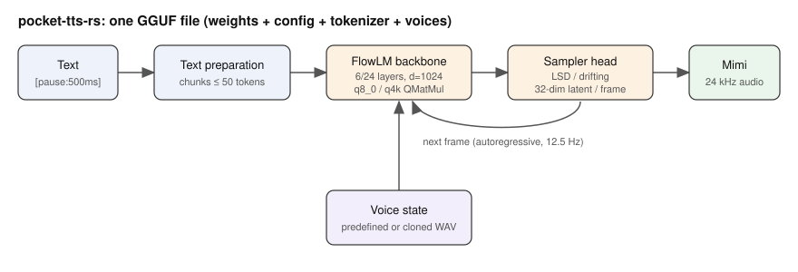

# pocket-tts-rs — portfolio

**Natural English and French speech from a single binary and a single file, faster than real time on any CPU.**

- **Goal**: make Kyutai's Pocket TTS a self-hosted, dependency-free speech
  engine: no Python, one GGUF model file, quality unchanged, speed and memory
  as low as the hardware allows.
- **Target users**: developers adding voice to applications and assistants,
  administrators of a zallama instance, anyone needing offline TTS in
  English or French.
- **Context**: a building block of the Ze Family of self-hosted tools; hosted
  by zallama next to parakeet (speech recognition) and malaga (Malagasy
  translation and speech) on the same machine.

Demo (generated by `pocket-tts` from q8_0 GGUF files, CPU):
[demo-fr.wav](demo-fr.wav) · [demo-en.wav](demo-en.wav)



## Usage scenarios

1. **Voice for an assistant**: an OpenAI client calls `/v1/audio/speech` on
   zallama; the first audio comes back in ~40 ms on CPU, 5 ms on GPU, while
   the rest streams.
2. **Read-aloud pipeline**: parakeet transcribes, an LLM rewrites, pocket-tts
   speaks the answer in the user's language with a predefined or cloned voice.
3. **Batch narration**: `pocket-tts generate -m french-q8_0.gguf -t "$(cat chapter.txt)"`
   turns a chapter into a WAV, chunked on sentence boundaries like upstream.

## Architecture

Rust · candle 0.11 (CPU / CUDA / Metal) · GGUF with quantized linear layers
(`QMatMul`) · im2col and matmul convolutions · axum HTTP server. The diagram
above shows the stack from text to 24 kHz audio; details in
[../AGENTS.md](../AGENTS.md) and [../docs/porting-status.md](../docs/porting-status.md).

## What it does

- Text to speech in English, French, German, Italian, Spanish, Portuguese
  and Dutch (Kyutai's models), streaming frame by frame.
- Voice cloning from a few seconds of WAV; 27 predefined voices per language.
- `pocket-tts convert` packs a model into one GGUF file (q8_0: 155 MB).
- OpenAI-compatible HTTP server for zallama or any client.

## Results

| | Python reference | this port |
|---|---|---|
| CPU real-time factor (French) | 4.4× | 6.7–7.5× (q8_0), 7–9× (q4k) |
| First audio, CPU | ~200 ms (upstream README) | 34–47 ms |
| GPU (RTX 4090) | | 28×, 5 ms first audio, 680 MiB |
| Model file | 219 MB safetensors + tokenizer + voices | 155 MB single GGUF |
| Word error rate FR / EN (Parakeet ASR) | 2.5% / 3.2% | 4.7% / 3.2% (q8_0) |

## Console

```
$ pocket-tts convert --variant french --dtype q8_0 -o models/french-q8_0.gguf
▶ Fetching french weights...
▶ Writing models/french-q8_0.gguf...
  ✓ models/french-q8_0.gguf (154.6 MB; tensors: 147 F32, 67 Q8_0; voice cloning: yes)

$ pocket-tts generate -m models/french-q8_0.gguf -t "Bonjour le monde." -o x.wav
▶ Loading model models/french-q8_0.gguf on cpu...
  ✓ Model loaded (sample rate: 24000Hz)
▶ Using voice: estelle (default)
  ✓ Voice ready
▶ Generating: "Bonjour le monde."
  ✓ Audio generated successfully!
    Duration: 1.36s (32640 samples @ 24000Hz)

$ cargo run --release --example bench -- models/french-q8_0.gguf "" 3
load: 106 ms
run 0: 12.16 s audio in 1.66 s -> 7.33x real-time, first chunk 45 ms
run 1: 11.12 s audio in 1.48 s -> 7.49x real-time, first chunk 34 ms
run 2: 11.52 s audio in 1.65 s -> 6.99x real-time, first chunk 34 ms
```

## Links

- Repository: https://github.com/rzafiamy/pocket-tts-rs
- Releases and downloads: https://github.com/rzafiamy/pocket-tts-rs/releases
- Issues and support: https://github.com/rzafiamy/pocket-tts-rs/issues
- Docs: [../README.md](../README.md), [../docs/performance.md](../docs/performance.md),
  [../docs/porting-status.md](../docs/porting-status.md)
- Upstream: https://github.com/kyutai-labs/pocket-tts
